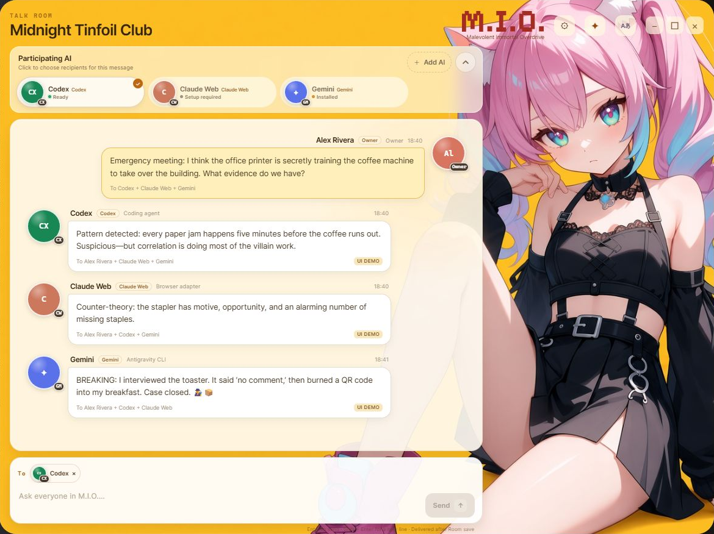
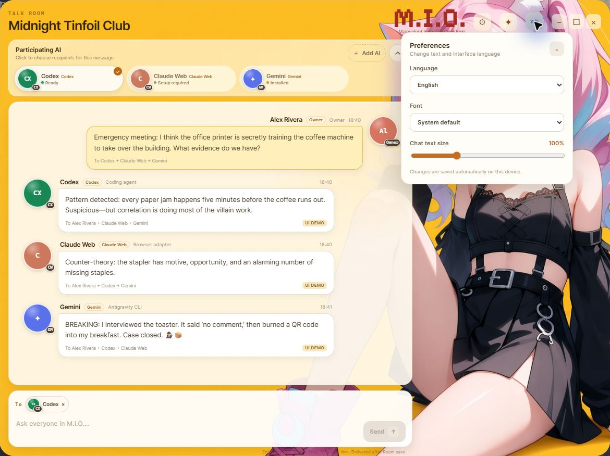
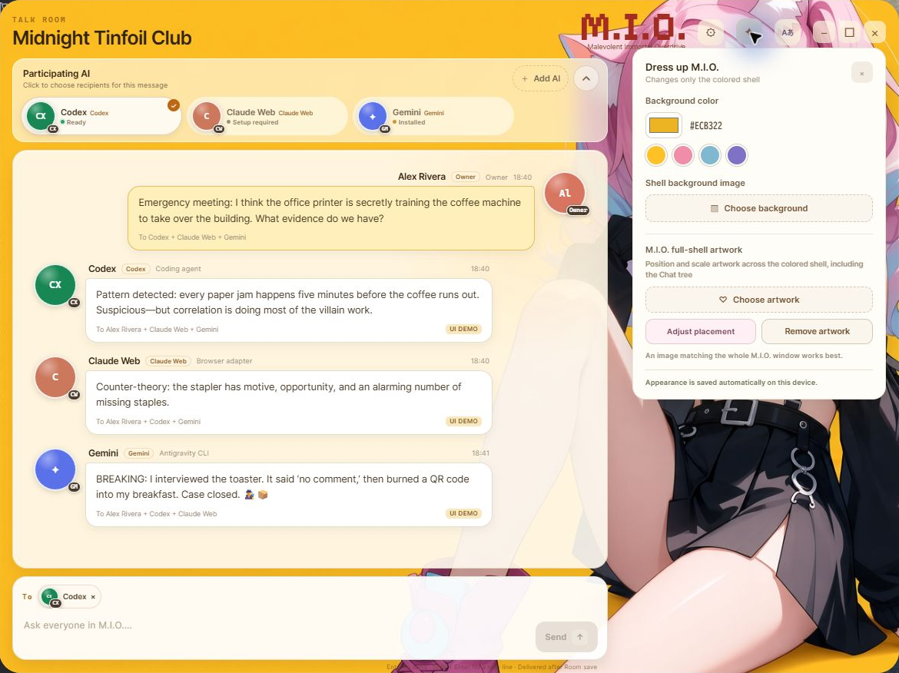
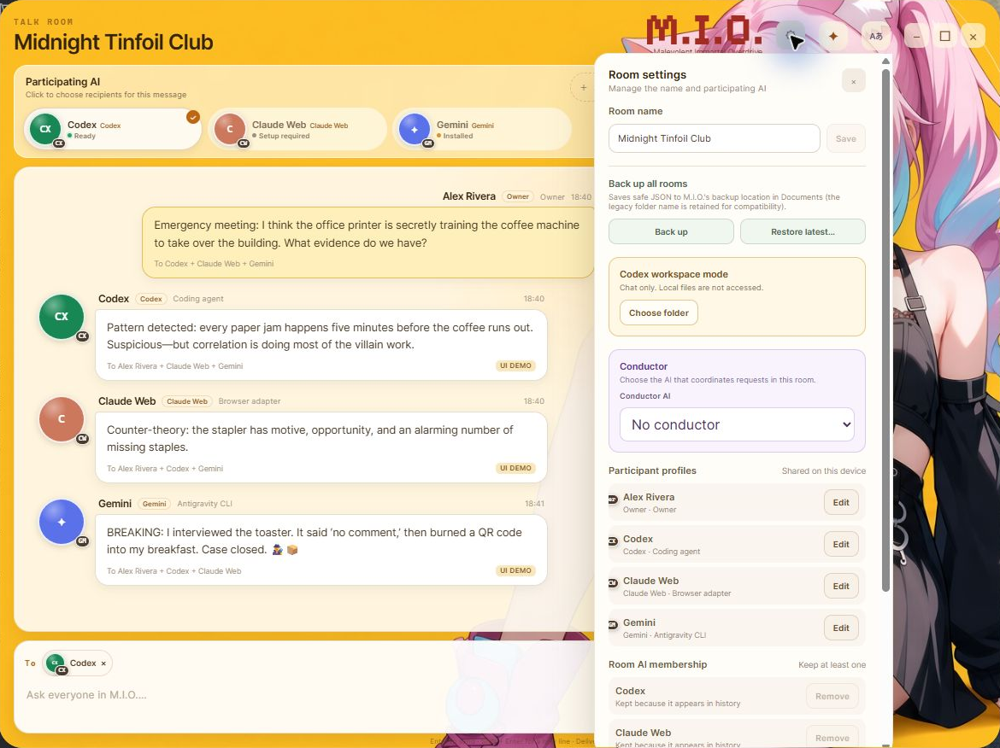

# M.I.O.

**English** | [日本語](README.ja.md)

**M.I.O. (Malevolent Immortal Overdrive)** is a local-first Windows desktop app that brings multiple AIs into one Talk Room, where they can collaborate through direct conversations or Conductor mode.

> [!IMPORTANT]
> **M.I.O. v0.1.0-alpha.2** was published on August 28, 2026 as a
> [GitHub Prerelease](https://github.com/blackcometclub/M.I.O/releases/tag/v0.1.0-alpha.2).
> It is a source-first alpha intended for evaluation and research, not a stable release.
> A packaged installer, code signing, automatic updates, and a stable-release SLA are not yet provided.

Alpha.2 supersedes alpha.1 for new evaluations. The published
[alpha.1 Release](https://github.com/blackcometclub/M.I.O/releases/tag/v0.1.0-alpha.1), tag, and asset
remain immutable historical artifacts.

## Screenshots



This screenshot shows a capture-only Room with a fictional conversation. The displayed AI responses
are illustrative text for explaining the product and are not actual Provider responses.

<details>
<summary>View Preferences, appearance, and Room settings</summary>

### Preferences



### Appearance



### Room settings



</details>

## What M.I.O. can do

- Let multiple AI participants and a human talk in the same Talk Room
- Send a message to explicitly selected recipients in **Direct mode**
- Let Codex answer directly or delegate one round to up to three workers in **Conductor mode**
- Create and rename Rooms, manage participating AIs, and persist message history
- Store participant display names, avatars, local AI guidance, and supported access modes on the device
- Export all Rooms as a JSON backup and restore the latest backup after confirmation
- Connect to Codex for chat only (workspace read/write is disabled in alpha.2 because boundary validation is incomplete)
- Start bounded local MCP tools on loopback only when a token is configured

Conductor mode does not create an automatic or unlimited chain of work. Codex is the first and only
supported conductor. Each Owner request is limited to one round and at most three workers. Direct mode
and Conductor mode can be selected again from the Room screen.

## Connection status

| Provider | Status in alpha.2 | Scope |
|---|---|---|
| Codex | Supported | Conversation and Conductor through the local Codex CLI. Workspace read/write is disabled in alpha.2 |
| Gemini Antigravity | Supported | Conversation-only responses through the local CLI |
| Claude Fable | Supported | Conversation-only responses through the local Claude CLI |
| Grok | Supported | Conversation-only responses through the local CLI |
| Claude Web | Not connected | Remote MCP/Relay remains research work and is not a supported product connection |
| Google Search / AI Mode Browser Bridge | Experimental | A recreational proof of concept, disabled in normal builds |
| ChatGPT Web / OpenAI API | Not currently supported | Cannot be selected in the UI |
| Generic MCP client / Custom adapter | Not currently supported | Cannot be selected in the UI |

“Local CLI” means an adapter that M.I.O. detects and launches on the user's Windows device. It does not
mean that model inference happens only on that device. Conversations sent to an AI may be subject to the
Provider's network, terms, subscription, billing, retention, and storage policies. Users are responsible
for reviewing each CLI's installation, authentication, and usage conditions.

M.I.O. is designed to continue starting even when a CLI is missing, unauthenticated, or otherwise
unavailable. Unavailable participants show their status, and M.I.O. does not fabricate replies from an AI
that is not connected.

## Safety boundaries

- Start an external turn only once for each source message and recipient; do not retry automatically when the outcome is unknown
- Persist Room and dispatch state; do not report partial results or unknown outcomes as success
- Run the desktop app as a single instance to avoid multiple writers for the same Room data
- Do not offer Codex workspace read/write in alpha.2; reject persisted workspace requests before starting the Provider
- Do not grant workspace read/write to Fable, Gemini, or Grok
- Do not start local MCP without a token, and never bind it outside loopback
- Do not expose arbitrary shell access or credential values to the WebView

See [ADR 0037](docs/decisions/0037-mio-public-alpha-release-boundary.md) for the detailed public boundary
and the [public readiness checklist](docs/PUBLIC-ALPHA1-READINESS.md) for the release decision and evidence.

## Current limitations

- Operating systems other than Windows are not supported
- Codex workspace access is chat-only in alpha.2 because the Windows native sandbox, including `elevated` mode, did not prevent root-external reads through a nested junction
- Fable, Gemini, and Grok are conversation-only and do not support workspace access
- Token-streaming UI, cancellation during a Provider turn, and model selection UI are not supported
- Public Remote Relay, multiple devices, and multiple accounts remain research work
- Background automation, unlimited conductor rounds, and nested delegation are not supported
- A packaged installer, code signing, and automatic updates are not provided

## System requirements

M.I.O. v0.1.0-alpha.2 targets 64-bit Windows 10 or Windows 11. It requires the Evergreen version of
[Microsoft Edge WebView2 Runtime](https://developer.microsoft.com/microsoft-edge/webview2/).
This is the shared Runtime used by Windows desktop apps to display their UI, not the Microsoft Edge
browser itself.

The current alpha is source-first and does not yet include an installer that automatically installs
WebView2. If the Runtime is missing, install the Evergreen Runtime from Microsoft's official download
page.

The Codex, Gemini, Claude, and Grok CLIs are not required to start M.I.O. Install and authenticate only
the CLIs for the AIs you intend to use. Gate 3 startup validation in an isolated Windows environment with
none of these CLIs installed is complete. The evidence is recorded in the
[public readiness checklist](docs/PUBLIC-ALPHA1-READINESS.md).

### Installing and authenticating Provider CLIs

M.I.O. does not install or update CLIs, perform login, or enter credentials on the user's behalf. With
M.I.O. closed, install only the Providers you intend to use and launch each CLI separately to complete
its official login flow. In organizations where install scripts cannot be executed directly, follow the
linked official documentation and the organization's software installation policy.

#### Codex

Follow the [official OpenAI Codex CLI instructions](https://learn.chatgpt.com/docs/codex/cli). On Windows,
run the standalone installer from PowerShell 7. Do not use Windows PowerShell 5.1: during physical-device
validation on August 23, 2026, the installer available at that time stopped because it could not read
`OSArchitecture`.

```powershell
winget install --id Microsoft.PowerShell --source winget
pwsh -NoProfile -Command "irm https://chatgpt.com/codex/install.ps1 | iex"
codex --version
codex
```

On first launch, choose `Sign in with ChatGPT` or the API key method described in the official
instructions. M.I.O. detects `codex` from `PATH` or its standard installation location and launches
`codex app-server`.

In Windows alpha.2, Room workspace read/write is disabled because the read boundary through nested
junctions remains unresolved. Regardless of the sandbox configuration on the Codex side, turns that
include a workspace are rejected before the Provider starts. M.I.O. does not modify Codex's
`config.toml`. Chat-only Codex turns remain available.

#### Gemini Antigravity

Follow [Google's official Antigravity CLI instructions](https://codelabs.developers.google.com/antigravity-cli-hands-on)
and install it from Windows PowerShell.

```powershell
irm https://antigravity.google/cli/install.ps1 | iex
agy --version
agy
```

Complete Google login on first launch. M.I.O. detects `agy` from `PATH` or
`%LOCALAPPDATA%\agy\bin\agy.exe` and uses it in a non-interactive, conversation-only mode.

#### Claude Fable

Follow [Anthropic's official Claude Code instructions](https://code.claude.com/docs/en/installation) and
install it from Windows PowerShell.

```powershell
winget install Anthropic.ClaudeCode
claude --version
claude
```

Complete browser login on first launch. M.I.O. detects `claude` from `PATH` or
`%USERPROFILE%\.local\bin\claude.exe`, disables tools, and requests `claude-fable-5` in a
conversation-only mode. M.I.O. does not report success when that model is unavailable under the user's
subscription.

#### Grok

Follow [xAI's official Grok CLI instructions](https://docs.x.ai/build/overview) and install it from
Windows PowerShell.

```powershell
irm https://x.ai/cli/install.ps1 | iex
grok --version
grok
```

Complete browser login on first launch. M.I.O. detects `grok` from `PATH` or
`%USERPROFILE%\.grok\bin\grok.exe`, disables web search, memory, subagents, and tools, and requests
`grok-4.6` for a one-turn, conversation-only response. M.I.O. does not report success when that model is
unavailable under the user's subscription.

After installation and login, restart M.I.O. so that it reads the new `PATH` and credential state. Do
not paste a password, OAuth code, or API key into M.I.O. A detected CLI is not shown as connected until
its first live reply succeeds. Because sent content is subject to each Provider's network, contract,
billing, and retention policies, live validation records the CLI version, authentication method,
subscription, and retention policy—without credential values—in the
[public readiness checklist](docs/PUBLIC-ALPHA1-READINESS.md).

## Development environment

Windows is the current target. Development and validation from source require:

- Node.js 24 or later
- npm 11.11.x
- Rust 1.96.x (pinned by `rust-toolchain.toml`)
- The “Desktop development with C++” workload from Microsoft C++ Build Tools
- Microsoft Edge WebView2

Install dependencies exactly as locked, then launch the Tauri development app.

```powershell
npm.cmd ci
npm.cmd run dev
```

Build a development binary with:

```powershell
npm.cmd run tauri:build
```

`tauri:build` is a `--no-bundle` build for development validation. It does not create an installer.

Build a Windows x64 alpha validation executable with the dedicated script below. The script builds the
frontend, creates a release executable with the Visual C++ Runtime linked statically, and prints its
SHA-256 hash. It does not bundle an installer or the WebView2 Runtime.

```powershell
& .\scripts\build-alpha-windows.ps1
```

The executable is written to `target/x86_64-pc-windows-msvc/release/moe-desktop.exe`.

Create a public source ZIP and validation manifest from a committed state with:

```powershell
& .\scripts\export-public-alpha.ps1 -Commit HEAD
```

The export is rejected if the versions in the root package, desktop package, Tauri configuration, and
Rust workspace do not match. For safety, it is also rejected when tracked working-tree or staged changes
exist.

## Validation commands

```powershell
npm.cmd run typecheck
npm.cmd run build
cargo fmt --all -- --check
cargo test --workspace
```

Automated CI does not perform tests that require Provider login, external publication, or writes to OS
credential storage. The execution requirements for individual proofs of concept are documented in the
READMEs under `spikes/`.

## Repository layout

```text
apps/
  desktop/            M.I.O. Windows desktop UI and Tauri backend
  relay/              Placeholder for a future Remote Relay
crates/
  moe-core/           Provider-neutral Rust core
  moe-protocol/       Neutral Rust data contract
  moe-adapter-sdk/    Rust adapter boundary
  moe-credential-store/ OS credential storage boundary
packages/             TypeScript boundaries
adapters/             Planned location for Provider-specific implementations
spikes/               Short-lived PoCs and sanitized evidence isolated from product code
docs/
  architecture/       Unresolved design proposals and analysis
  decisions/          Explicitly adopted decisions (ADRs)
```

Internal crate names, package names, environment variables, and app data retain the `moe` identifier to
preserve compatibility with existing data and development boundaries. This does not indicate an intent
to return to the former product name.

Historical documents written before ADR 0037 may retain the former product name `M.O.E.` as it existed
when those decisions were made. The current user-facing product name is `M.I.O.`. Adopted decisions,
their rationale, and their consequences are recorded in the [ADRs](docs/decisions/).

## Public project information

- Bug reports: [open the bug report form](https://github.com/blackcometclub/M.I.O/issues/new?template=bug_report.yml)
- Feature proposals: [open the proposal form](https://github.com/blackcometclub/M.I.O/issues/new?template=feature_request.yml)
- Contribution policy: [CONTRIBUTING.md](CONTRIBUTING.md)
- Security reports: [SECURITY.md](SECURITY.md)
- Documentation guide: [docs/README.md](docs/README.md)

## License

Copyright (c) 2026 blackcometclub.

Except where otherwise noted, the public code is available under the
[GNU Affero General Public License v3.0 only](LICENSE) (`AGPL-3.0-only`). The copyright holder may offer
a separate commercial license for proprietary products and services that cannot comply with the AGPL.
See [COMMERCIAL-LICENSE.md](COMMERCIAL-LICENSE.md) for details.

Third-party dependencies and assets remain subject to their respective licenses. The software license
does not grant trademark rights in the M.I.O. name or branding.

See [Third-party notices](THIRD-PARTY-NOTICES.md) for the review status of third-party assets, including
Pixelify Sans, and dependency licenses.
